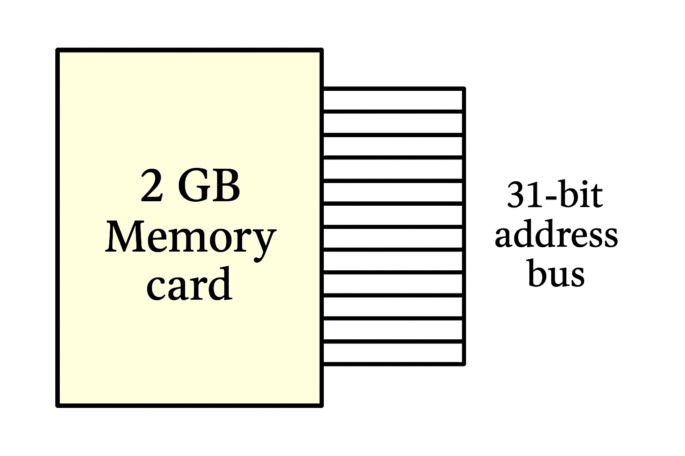

# Why is memory size a power of 2?

Memory sizes are in power of two because computers operate on a **binary system**. All data and memory addresses are represented by bits, which can only be a 0 or a 1. This base-2 nature makes powers of two the most efficient and logical way to build and manage memory.

---

## The Role of Binary Addressing 

The core reason lies in **binary addressing**. Each memory location needs a unique address, and these addresses are binary numbers. The number of bits available for an address determines the maximum number of memory locations that can be accessed.

The relationship is exponential: with '$n$' address lines, a computer can access exactly $2^n$ unique memory locations.

* **1 address line** can access $2^1$ = 2 memory locations.
* **2 address lines** can access $2^2$ = 4 memory locations (addresses: 00, 01, 10, 11).
* **33 address lines** are required to access $2^{33}$ bytes, which equals 8 gigabytes (GB).

Designing hardware (CPUs, memory controllers) around powers of two is far simpler and more efficient. A memory module with a capacity that isn't a power of two would lead to wasted addressing space and more complex, slower hardware. This fundamental design principle has become a universal standard, leading to the familiar memory sizes we see today (e.g., 4GB, 8GB, 16GB, 32GB).

---

## What if a memory module was 3GB? 

A 3GB memory module would be inefficient and create addressing problems. Here’s why:

### 1. Wasted Address Space

To access any location in a 3GB module, the system needs enough address lines to reach the highest address.

* **2GB** ($2^{31}$ bytes) requires **31 address lines**.
* **4GB** ($2^{32}$ bytes) requires **32 address lines**.

To access all of 3GB, the system must use **32 address lines**. This gives it the ability to address 4GB worth of locations. Since only 3GB of physical memory exists, the entire 1GB address range between the 3GB and 4GB mark is **wasted**. Any attempt to access an address in this gap would cause an error.

### 2. Complex Memory Mapping

Because 3 is not a power of two, the memory controller can't use simple binary logic to locate data. It would require extra hardware to determine if a requested address is in the valid 3GB range or in the invalid 1GB gap. This adds complexity and latency to the memory controller, making the system slower and more expensive to build.
